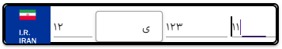

# vue-iranian-license-plate

A Vue 2 + Vuetify component for displaying and editing Iranian license plates, with built-in validation and theming.

[](https://www.npmjs.com/package/vue-iranian-license-plate)
[](LICENSE)
[](https://www.npmjs.com/package/vue-iranian-license-plate)

---



> *Live preview of the `vue-iranian-license-plate` component in editable and read-only modes.*

---

## 🚗 Features

- Fully supports the Iranian license plate format (including Persian characters)
- Two modes: **Live Editable** and **Read-Only Display**
- Built-in validation with instant visual feedback
- Themed for various plate types: private, public, military, diplomatic, and temporary
- Fully customizable and easy to integrate with Vue 2 + Vuetify projects

---

## 📦 Installation

```bash
npm install vue-iranian-license-plate
````

---

## 🛠️ Usage

### 1. Import and Register the Component

In your `.vue` or `.js` file:

```js
import IranianLicensePlate from 'vue-iranian-license-plate'

export default {
  components: {
    IranianLicensePlate
  },
  data() {
    return {
      plate: ''
    }
  }
}
```

### 2. Use the Component in Your Template

```html
<iranian-license-plate v-model="plate" />
```

---

## ⚙️ Props

| Prop                | Type      | Default     | Description                                                                      |
| ------------------- | --------- | ----------- | -------------------------------------------------------------------------------- |
| `value` / `v-model` | `String`  | `''`        | License plate value (two-way binding)                                            |
| `readonly`          | `Boolean` | `false`     | Display plate in read-only mode                                                  |
| `type`              | `String`  | `'private'` | Plate type: `'private'`, `'public'`, `'military'`, `'diplomatic'`, `'temporary'` |
| `error`             | `Boolean` | `false`     | Force error state (e.g. for form validation)                                     |
| `rules`             | `Array`   | `[]`        | Custom validation rules (Vuetify style)                                          |
| `label`             | `String`  | `''`        | Optional label text above the plate                                              |
| `hint`              | `String`  | `''`        | Optional hint text below the input                                               |

---

## 🖼️ Plate Types & Styles

The component visually adapts based on the `type` prop:

* `private` (default): White background with black digits
* `public`: Yellow background
* `military`: Olive green style
* `diplomatic`: Blue or red style
* `temporary`: Orange/red tones

You can style it further using custom CSS classes or Vuetify theming.

---

## 📋 Notes

* Supports standard Iranian license plate format (two digits, Persian letter, three digits, region code).
* Built-in format validation and feedback.
* Easily integrable into any Vue 2 + Vuetify form or wizard.

---

## 🧪 Example

```html
<template>
  <v-form>
    <iranian-license-plate
      v-model="plate"
      :type="'public'"
      :readonly="false"
      label="Vehicle Plate"
      hint="Enter your valid Iranian license plate"
    />
  </v-form>
</template>

<script>
import IranianLicensePlate from 'vue-iranian-license-plate'

export default {
  components: { IranianLicensePlate },
  data() {
    return {
      plate: ''
    }
  }
}
</script>
```

---

## 📄 License

This project is licensed under the [MIT License](LICENSE).

````